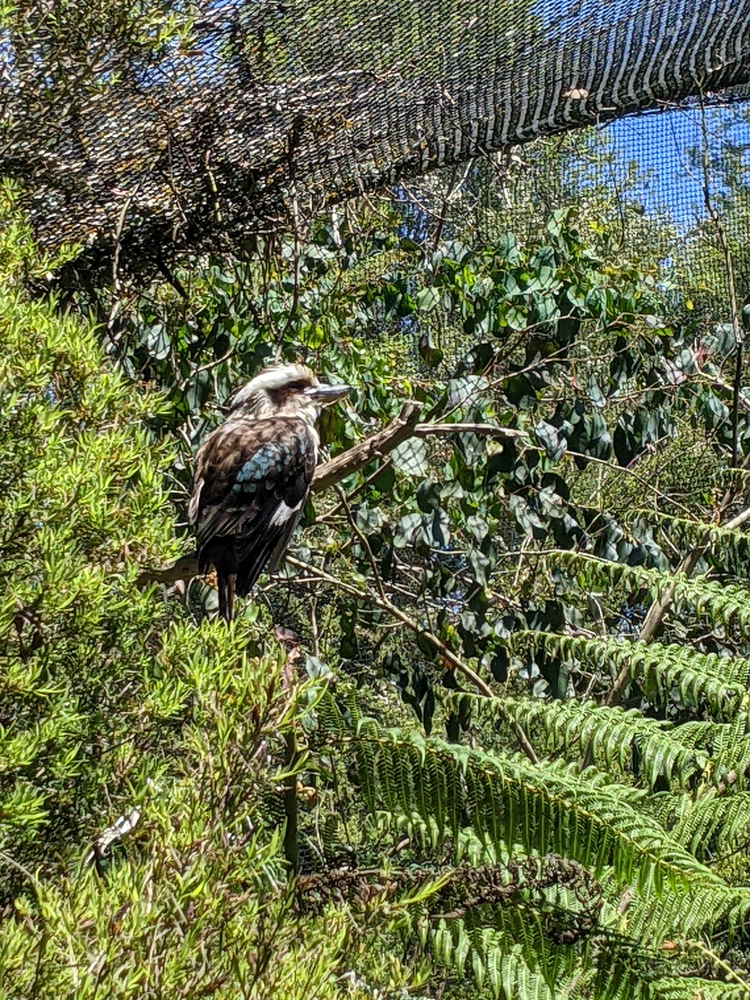
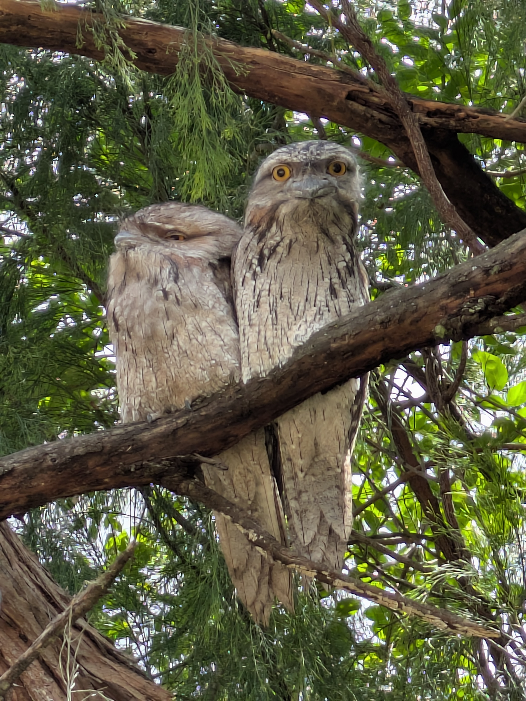

# is-it-tawny
Give it an image and it'll tell you if the image contains a Tawny Frogmouth or not.

# Description

I have a collection of photos that either have Tawny Frogmouth birds or don't have that I have labelled manually.

The labels exist in a CSV file with filename, label columns where the label is either 'is_tawny' or 'not_tawny'.

This is a pipeline in python to train a model to distinguish photos that contain Tawny Frogmouths or not.

## Pipeline details

1. Load your CSV (filename, label)
2. Create a PyTorch Dataset that reads images from disk
3. Train a transfer‑learning model (ResNet‑18)
4. Export to ONNX so you can run it in C++ with OpenCV

# Developing the package

## Creating the conda environment

```shell
conda create --name is_it_tawny --file is_it_tawny.lock
conda activate is_it_tawny
```

## Install pre-commit hooks

```shell
pre-commit install
```

## Bulid instructions

```script
mkdir -p build
cd build
cmake -B build -DCMAKE_EXPORT_COMPILE_COMMANDS=ON ..
make
```

## Running the inference

Examples:




```script
$ ./build/infer tawny_classifier.onnx tests/test_not_tawny.jpg
Prediction: not_tawny
  P(not_tawny) = 0.999424
  P(is_tawny)  = 0.000576206
```



```script
$ ./build/infer tawny_classifier.onnx tests/test_is_tawny.jpg
Prediction: is_tawny
  P(not_tawny) = 0.00652952
  P(is_tawny)  = 0.99347
```
